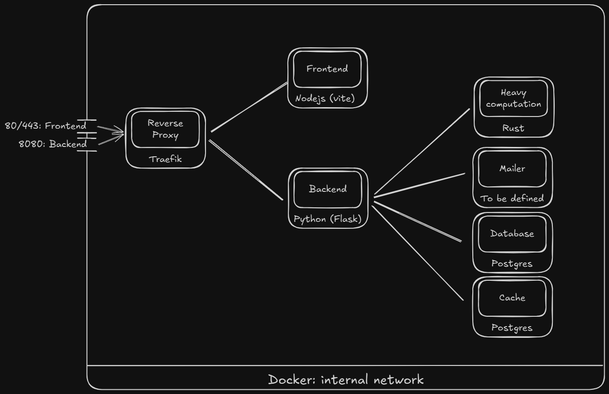

# Deployment architecture with docker

## Docker services
- `client`: Frontend written in _Vue_ with _Typescript_ and built with _vite_ and _nodejs_
- `backend_server`: Backend written in _Python_ using the _Flask_ framework
- `heavy_computation`: _Rust_ microservice for performing fast and eficcient heavy calculations
- `mailer`: _python_ Microservice for mailing with _Resend_ api
- `redis`: Cache database for session storage
- `postgres`: Main database for data storage

## Funcionality

Basic user and post CRUD with some heavy operations (to be defined) and posting notifications via email

## Backend Endpoints


### Login

```
(POST) /auth/login
```

#### Body

- **_Username_**: `string` _(cannot contain spaces)_
- **_Password_**: `string` _(minimum 8 characters, cannot contain spaces)_


#### Example Request

```ts
const response = await fetch(`${url}/auth/login/`, {
    method: "POST",
    headers: {
        "Content-Type": "Application/json"
    },
    body: JSON.stringify({
        username: "el_atla",
        password: "12345678",
    })
});
```


#### Example Response
```json
{
    "message": "Logged in succesfully!",
    "data": {
        "username": "el_atla",
        "email": "test@decoupled.dev"
    }
}
```

### Register

```
(POST) /auth/register
```

#### Body

- **_Username_**: `string` _(cannot contain spaces)_
- **_Password_**: `string` _(minimum 8 characters, cannot contain spaces)_
- **_Email_**: `string` _(email format)_


#### Example Request

```ts
const response = await fetch(`${url}/auth/register`, {
    method: "POST",
    headers: {
        "Content-Type": "Application/json"
    },
    body: JSON.stringify({
        username: "el_atla",
        password: "12345678",
        email: "el_atla@decoupled.dev"
    })
});
```

#### Example Response 

```json
{
    "message": "User registered successfully!"
}
```

### Send reset token
    (POST) /auth/send-reset-token

#### Body

- _**Email**_: `string` _(mail format)_

#### Example request

```ts
const response = await fetch(`${url}/auth/send-reset-token`, {
    method: "POST",
    headers: {
        "Content-Type": "Application/json"
    },
    body: JSON.stringify({
        email: "el_atla@decoupled.dev"
    })
});
```

#### Example Response 

```json
{
    "message": "Reset token sent successfully"
}
```

### Restart password
    (PUT) /auth/restart-password

#### Body

- _**Email**_: `string` _(mail format)_
- _**Token**_: `string` _(6 character hex token)_
- _**NewPasword**_: `string` _(8 characters minimum)_

#### Example request

```ts
const response = await fetch(`${url}/auth/restart-password`, {
    method: "PUT",
    headers: {
        "Content-Type": "Application/json"
    },
    body: JSON.stringify({
        email: "el_atla@decoupled.dev",
        token: "123456",
        newPassword: "supersecurepassword"
    })
});
```

#### Example Response 

```json
{
    "message": "Pasword reset successfully"
}
```

### Post message _(requires session)_
    (POST) /posts

#### Body

- _**Title**_: `string` _(max 100 characters)_
- _**Content**_: `string` _(max 500 characters)_

#### Example request

```ts
const response = await fetch(`${url}/messages`, {
    method: "POST",
    headers: {
        "Content-Type": "Application/json"
    },
    credentials: "include",
    body: JSON.stringify({
        title: "My new post",
        content: "This is the content of my new post. It contains detailed information about the topic I want to share with others."
    })
});
```

#### Example Response 

```json
{
    "message": "Post created successfully"
}
```

### Get all posts
    (GET) /posts

#### Body

_None_

#### Example request

```ts
const response = await fetch(`${url}/posts`, {
    method: "GET",
    credentials: "include"
});
```

#### Example Response 

```json
{
    "message": "Got posts!",
    "data": [
        {
            "id": "4f8b3c7e-9d3a-4a6b-8f2e-3e2d9c1a7b5f",
            "author_email": "test@decoupled.dev",
            "author_username": "test_user",
            "title": "My awesome post",
            "content": "All about my post..."
        }
    ]
}
```

### Get posts by user
    (GET) /posts/<user_username>

#### Body

_None_

#### Example request

```ts
const response = await fetch(`${url}/posts/test_user`, {
    method: "GET",
    credentials: "include"
});
```

#### Example Response 

```json
{
    "message": "Got posts!",
    "data": [
        {
            "id": "4f8b3c7e-9d3a-4a6b-8f2e-3e2d9c1a7b5f",
            "author_email": "test@decoupled.dev",
            "author_username": "test_user",
            "title": "My awesome post",
            "content": "All about my post..."
        }
    ]
}
```

## Todos:
 - [x] Define Postgres data model
 - [x] Define Redis schema
 - [x] Develop Backend Main Server _(python)_
   - [x] Auth 
     - [x] Sessions _(with redis state)_
     - [x] Sign in & Sign up funcionality
     - [x] Cookies jwt session token
     - [x] Routes
   - [ ] Business
     - [x] Routes
     - [x] Microservice client
   - [ ] Replace development server for WSGI Server
 - [x] Develop frontend client _(vue ts)_
   - [x] Auth view
       - [x] Login component
       - [x] Register component
   - [x] Business view
     - [x] Create post component
     - [x] View post component
 - [x] Develop Heavy Computation Microservice _(rust)_
   - [x] Define behavior
   - [x] Declare protobuffers
   - [x] Microservice server
 - [x] Develop Mailer Server _(language to be defined, probably rust)_
   - [x] Resend integration
   - [x] Declare protobuffers
   - [x] Microservice server
 - [x] Define reverse proxy behavior _(traefik)_

## Docker architecture: 


